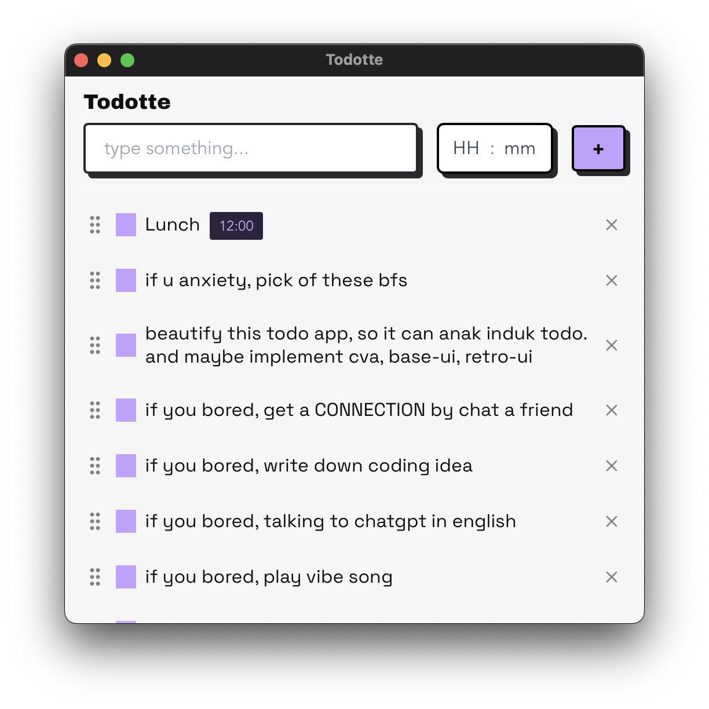
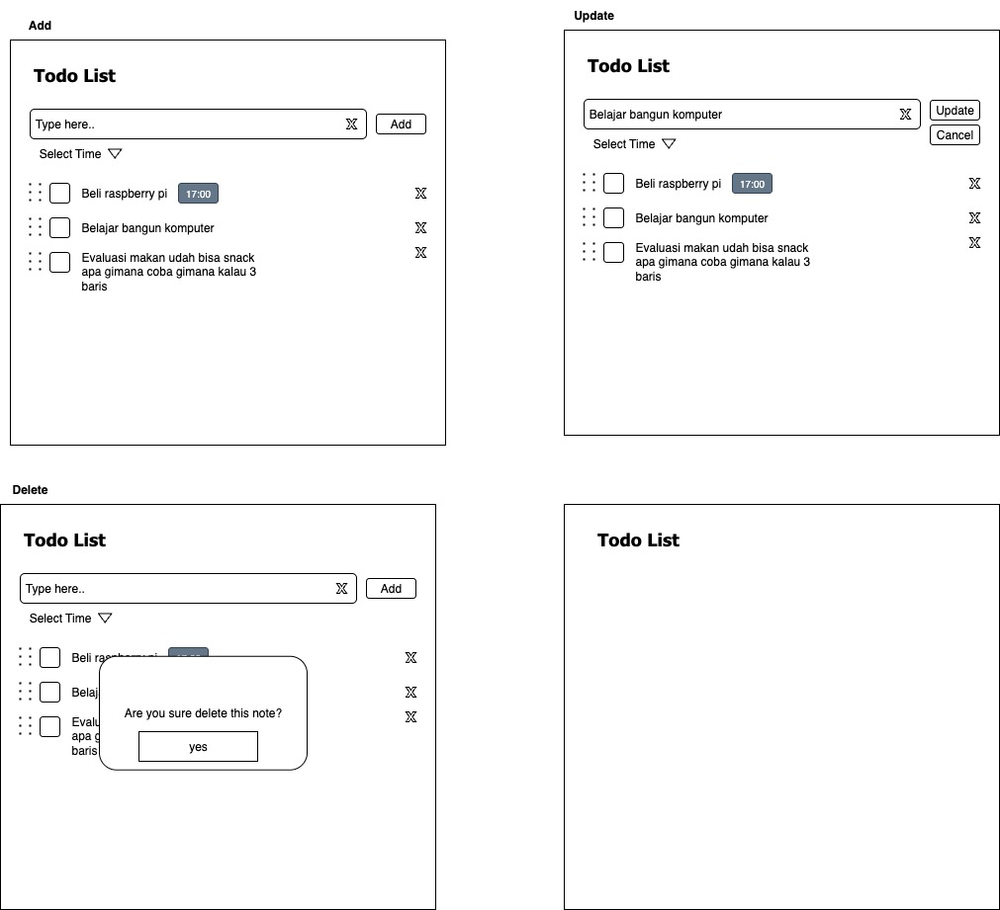

<div align="center">
  
</div>

# Todotte

Todotte is a lightweight, cross-platform todo desktop application built with Tauri (Rust + Vite). It helps you manage your tasks efficiently with a simple and intuitive interface, featuring task creation, deletion, drag-and-drop sorting, and reminder notifications.

## Features
- Create Tasks: Easily add new tasks with a title and optional details.
- Delete Tasks: Remove tasks you no longer need with a single click.
- Drag-and-Drop Sorting: Reorder tasks effortlessly using drag-and-drop functionality.
- Reminder Notifications: Set reminders for tasks and receive desktop notifications when they are due.
- Cross-Platform: Runs on Windows, macOS

## Tech Stack
- Tauri: A framework for building lightweight desktop apps using Rust for the backend and web technologies for the frontend.
- Rust: Powers the secure and performant backend.
- Vite: A fast build tool for the frontend, ensuring a modern development experience.
- HTML/CSS/JavaScript: Used for the frontend interface.

## Doc


## Installing on macOS

If you get a "damaged" or "unidentified developer" error:

1. Download the DMG file
2. Open Terminal
3. Run: xattr -d com.apple.quarantine /path/to/your-app.dmg
4. Double-click the DMG to open normally

```
Failure reason:
  specifiers in the lockfile don't match specifiers in package.json:
* 3 dependencies were removed: @tauri-apps/plugin-fs@~2.4.0, @tauri-apps/plugin-sql@~2.3.0, @tauri-apps/cli@^2.6.2
```

fix with

```
pnpm install --no-frozen-lockfile
```

## Drawio


